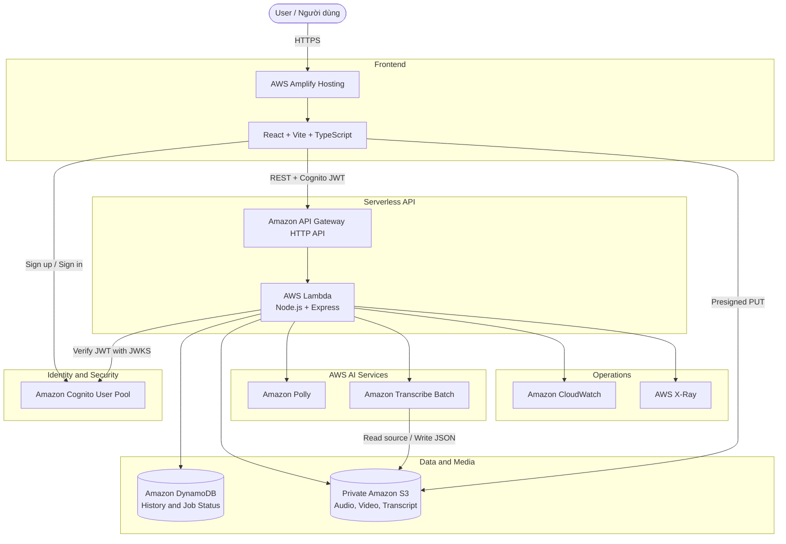
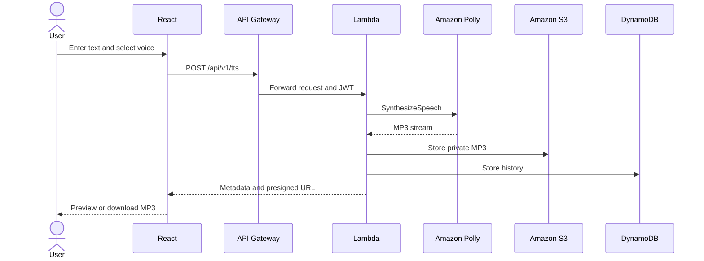
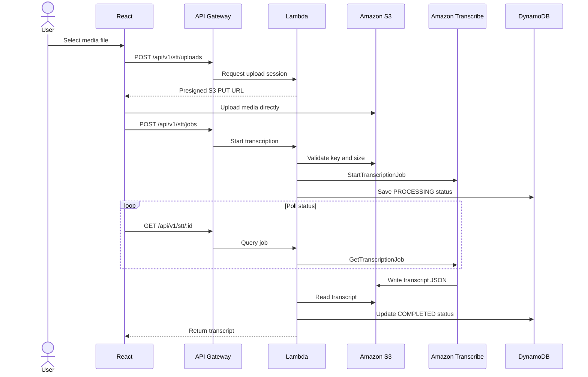

# Polly Voice

## A Unified AWS Serverless Solution for Text-to-Speech and Speech-to-Text

> **Region:** Europe (Stockholm) – `eu-north-1`  
> **Project type:** Personal AWS Serverless Application  
> **Production website:** <https://hieu.d1sl9gotr7i3f4.amplifyapp.com>  
> **Source repository:** <https://github.com/super-chickens-aws/polly-voice>

---

# 1. Executive Summary / Tóm tắt điều hành

## 1.1 English

Polly Voice is a serverless web platform that provides Text-to-Speech (TTS) and
Speech-to-Text (STT) capabilities for students, content creators, educators,
podcasters, and small teams. Users can enter text, configure a voice, preview
the result, generate MP3 media, upload audio or video files for transcription,
and manage their private conversion history.

The solution is implemented entirely with managed AWS services. React and Vite
are deployed through AWS Amplify Hosting. Amazon Cognito manages user
registration, email confirmation, and authentication. Amazon API Gateway and
AWS Lambda expose a Node.js and Express REST API. Amazon Polly synthesizes
speech, while Amazon Transcribe performs asynchronous batch transcription.
Amazon S3 stores private media and transcript files, and Amazon DynamoDB stores
conversion history and processing status.

Large STT files are uploaded directly from the browser to Amazon S3 through
short-lived presigned URLs. This design avoids the request payload limits of
API Gateway and Lambda and supports Amazon Transcribe batch files up to 2 GB.
The platform uses a pay-as-you-go model and can scale without provisioning or
maintaining servers.

## 1.2 Tiếng Việt

Polly Voice là nền tảng web serverless cung cấp chức năng chuyển văn bản thành
giọng nói (TTS) và chuyển giọng nói thành văn bản (STT), hướng đến sinh viên,
người sáng tạo nội dung, giảng viên, podcaster và các nhóm nhỏ. Người dùng có
thể nhập văn bản, cấu hình giọng đọc, nghe thử, tạo file MP3, tải audio hoặc
video để nhận dạng lời nói và quản lý lịch sử chuyển đổi riêng.

Giải pháp được xây dựng hoàn toàn bằng các dịch vụ managed của AWS. React và
Vite được triển khai qua AWS Amplify Hosting. Amazon Cognito quản lý đăng ký,
xác nhận email và đăng nhập. Amazon API Gateway cùng AWS Lambda cung cấp REST
API viết bằng Node.js và Express. Amazon Polly tổng hợp giọng nói, còn Amazon
Transcribe xử lý nhận dạng lời nói theo mô hình batch bất đồng bộ. Amazon S3
lưu media và transcript trong bucket private; Amazon DynamoDB lưu lịch sử và
trạng thái xử lý.

File STT dung lượng lớn được trình duyệt upload trực tiếp lên Amazon S3 bằng
presigned URL có thời hạn. Thiết kế này tránh giới hạn payload của API Gateway
và Lambda, đồng thời hỗ trợ file batch Transcribe đến 2 GB. Hệ thống sử dụng mô
hình trả phí theo mức dùng và có khả năng tự mở rộng mà không cần quản lý máy
chủ.

---

# 2. Problem Statement / Bài toán

## 2.1 What is the problem? / Vấn đề hiện tại

### English

Users who need narration or transcription often depend on separate desktop
applications or third-party websites. These solutions can be difficult to
integrate, may expose private media, and usually do not provide centralized
authentication, processing history, or cloud storage.

Traditional self-hosted speech systems introduce additional problems:

- Servers must be provisioned, patched, monitored, and scaled.
- Speech engines and media-processing dependencies must be installed.
- Large media uploads can overload the application server.
- User files and history are difficult to isolate securely.
- Upfront infrastructure costs are unsuitable for small workloads.

### Tiếng Việt

Người dùng cần tạo giọng đọc hoặc transcript thường phải sử dụng nhiều phần mềm
desktop hoặc website bên thứ ba. Các giải pháp này khó tích hợp, có thể làm lộ
media riêng tư và thường không có hệ thống đăng nhập, lịch sử xử lý hay lưu trữ
cloud tập trung.

Hệ thống speech tự quản lý theo cách truyền thống còn có các vấn đề:

- Phải cấp phát, cập nhật, giám sát và mở rộng máy chủ.
- Phải cài speech engine và thư viện xử lý media.
- Upload file lớn có thể làm quá tải application server.
- Khó cô lập file và lịch sử của từng người dùng.
- Chi phí hạ tầng cố định không phù hợp với workload nhỏ.

## 2.2 The solution / Giải pháp

### English

Polly Voice combines AWS AI and serverless services into one secure platform:

- Amazon Polly generates MP3 speech from text.
- Amazon Transcribe converts supported audio and video files to text.
- Amazon Cognito provides account registration and JWT authentication.
- Private Amazon S3 storage protects generated and uploaded media.
- Presigned URLs allow secure direct uploads and downloads.
- DynamoDB stores per-user history and asynchronous job states.
- Amplify, API Gateway, and Lambda provide a fully serverless application.

### Tiếng Việt

Polly Voice kết hợp các dịch vụ AI và serverless AWS thành một nền tảng:

- Amazon Polly tạo giọng nói MP3 từ văn bản.
- Amazon Transcribe chuyển audio và video được hỗ trợ thành văn bản.
- Amazon Cognito cung cấp đăng ký tài khoản và xác thực JWT.
- Amazon S3 private bảo vệ media được tạo và upload.
- Presigned URL cho phép upload/download trực tiếp, an toàn.
- DynamoDB lưu lịch sử theo người dùng và trạng thái job bất đồng bộ.
- Amplify, API Gateway và Lambda tạo thành ứng dụng hoàn toàn serverless.

## 2.3 Benefits and return on investment / Lợi ích và hiệu quả đầu tư

- Centralized TTS and STT workflows.
- No server provisioning or maintenance.
- Pay only for actual requests, characters, audio duration, and storage.
- Automatic scaling for irregular workloads.
- Reusable architecture for subtitles, translation, and automatic dubbing.
- Reduced development effort through managed AI services.
- Private media storage with temporary access instead of public objects.

---

# 3. Solution Architecture / Kiến trúc giải pháp

## 3.1 Overall architecture / Kiến trúc tổng thể

## 3.2 Text-to-Speech flow / Luồng TTS

## 3.3 Speech-to-Text flow / Luồng STT

## 3.4 AWS services used / Các dịch vụ AWS

| Service | Purpose | Selection reason |
|---|---|---|
| AWS Amplify Hosting | Host React frontend | Git-based CI/CD, HTTPS, CDN |
| Amazon Cognito | Authentication | Managed users, email confirmation, JWT |
| API Gateway HTTP API | Public API | Low-overhead serverless routing |
| AWS Lambda | Backend runtime | Automatic scaling and pay-per-use |
| Amazon Polly | Text-to-Speech | Managed voices and MP3 output |
| Amazon Transcribe | Speech-to-Text | Asynchronous batch transcription |
| Amazon S3 | Media storage | Private, durable, scalable object storage |
| Amazon DynamoDB | History and job state | Serverless NoSQL and on-demand billing |
| CloudWatch | Logs and metrics | Native Lambda/API monitoring |
| AWS X-Ray | Distributed tracing | Request-level performance analysis |
| AWS SAM | Infrastructure as Code | Repeatable serverless deployment |
| CloudFormation | Resource lifecycle | Controlled creation and updates |

## 3.5 Component design / Thiết kế thành phần

### Frontend

- **Workspace:** coordinates navigation and user state.
- **TTS interface:** text input, presets, voice settings, preview, download.
- **STT interface:** media selection, direct S3 upload, progress, polling.
- **History:** lists TTS/STT records and supports soft deletion.
- **Security:** integrates Cognito SRP authentication and token storage.
- **Services:** isolates REST API and S3 upload operations.

### Backend

- **Core:** environment validation and shared HTTP errors.
- **Security:** Cognito JWT verification middleware.
- **TTS module:** validates requests and coordinates Polly, S3, DynamoDB.
- **STT module:** creates upload sessions and coordinates Transcribe jobs.
- **Infrastructure:** Polly client, S3 storage, DynamoDB repositories.
- **Entry points:** local Express server and Lambda adapter.

---

# 4. Technical Implementation / Triển khai kỹ thuật

## 4.1 Implementation phases / Các giai đoạn triển khai

### Phase 1 – Research and architecture

- Analyze TTS/STT use cases.
- Compare managed AWS AI services with self-hosted speech engines.
- Select serverless architecture and `eu-north-1`.
- Draw data flows and security boundaries.

### Phase 2 – Local application

- Build React and TypeScript interface.
- Build Node.js and Express REST API.
- Create local media and authentication fallbacks.
- Implement TTS and STT domain models.

### Phase 3 – AWS integration

- Configure Cognito User Pool and public App Client.
- Deploy frontend with Amplify Hosting.
- Provision Lambda, API Gateway, S3, and DynamoDB using SAM.
- Integrate Amazon Polly and Amazon Transcribe.

### Phase 4 – Reliability improvements

- Fix Node.js and Linux native dependency build issues.
- Adapt Polly presets to voices available in Stockholm.
- Replace API-based STT file upload with direct S3 presigned upload.
- Add polling and detailed Transcribe failure handling.
- Refactor frontend and backend by business capability.

### Phase 5 – Testing and operations

- Validate SAM template.
- Build and test TypeScript projects.
- Verify Cognito-protected endpoints.
- Verify S3 CORS and direct upload.
- Verify Lambda health and Amplify deployments.
- Add CloudWatch dashboards and alarms as the next operational milestone.

## 4.2 Technical requirements / Yêu cầu kỹ thuật

### Development tools

- Node.js 22 LTS
- npm
- Git and GitHub
- AWS CLI v2
- AWS SAM CLI
- AWS account with access to `eu-north-1`

### Frontend

- React 19
- TypeScript
- Vite
- `amazon-cognito-identity-js`

### Backend

- Node.js 22
- Express
- TypeScript
- AWS SDK for JavaScript v3
- Zod validation
- `serverless-http`

### AWS permissions

The deployment identity requires permission to manage:

- CloudFormation
- Lambda and IAM execution roles
- API Gateway
- S3
- DynamoDB
- Cognito
- Amplify
- CloudWatch and X-Ray

The Lambda execution role should only access:

- The project media bucket.
- The project DynamoDB table.
- Required Polly operations.
- Required Transcribe job operations.
- CloudWatch Logs and X-Ray.

## 4.3 Production resources / Tài nguyên production

| Resource | Value |
|---|---|
| Region | `eu-north-1` |
| Amplify app | `polly-voice` |
| Amplify branch | `hieu` |
| API URL | `https://7x4houix91.execute-api.eu-north-1.amazonaws.com` |
| Lambda | `polly-voice-api-PollyVoiceFunction-kCHu2DIntLuz` |
| S3 bucket | `polly-voice-media-352225045098-eu-north-1` |
| DynamoDB table | `polly-voice-history` |
| Cognito User Pool | `eu-north-1_bherGvB78` |
| CloudFormation stack | `polly-voice-api` |

## 4.4 API surface / Danh sách API

| Method | Endpoint | Authentication | Purpose |
|---|---|---:|---|
| GET | `/health` | No | Backend health check |
| GET | `/api/v1/voices` | No | Supported Polly voices |
| POST | `/api/v1/tts/preview` | No | Short TTS preview |
| POST | `/api/v1/tts` | Optional | Generate and optionally persist TTS |
| GET | `/api/v1/tts/history` | Yes | TTS history |
| DELETE | `/api/v1/tts/:id` | Yes | Soft-delete TTS history |
| POST | `/api/v1/stt/uploads` | Yes | Create presigned upload session |
| POST | `/api/v1/stt/jobs` | Yes | Start Transcribe job |
| GET | `/api/v1/stt/:id` | Yes | Poll job and fetch result |
| GET | `/api/v1/stt/history` | Yes | STT history |
| DELETE | `/api/v1/stt/:id` | Yes | Soft-delete STT history |

## 4.5 Security implementation / Triển khai bảo mật

- S3 Block Public Access is enabled.
- S3 objects use server-side AES-256 encryption.
- Browser access is limited to temporary presigned URLs.
- S3 CORS only allows the Amplify production origin.
- API CORS only allows configured frontend origins.
- Cognito App Client has no client secret because React is a public SPA.
- Lambda verifies Cognito issuer, User Pool, and App Client claims.
- AWS credentials are never embedded in the frontend.
- DynamoDB uses encryption at rest.
- Object keys are prefixed by Cognito subject ID.
- Backend checks the expected key and uploaded file size.

## 4.6 Testing and validation / Kiểm thử

| Test | Expected result |
|---|---|
| `GET /health` | HTTP 200 and service status `ok` |
| TTS without text | HTTP 400 |
| Protected API without JWT | HTTP 401 |
| Unsupported media format | HTTP 400 |
| File larger than 2 GB | Rejected |
| Direct S3 PUT from Amplify origin | Successful |
| Direct S3 PUT from unknown origin | Blocked by CORS |
| Successful Transcribe job | Status becomes `COMPLETED` |
| Failed Transcribe job | Status `FAILED` and failure reason |
| Frontend production build | Successful |
| Backend build and automated test | Successful |
| SAM validation and deployment | Successful |

---

# 5. Timeline and Milestones / Kế hoạch và cột mốc

| Period | English milestone | Cột mốc tiếng Việt |
|---|---|---|
| Pre-project | Research speech services and define scope | Nghiên cứu dịch vụ speech và phạm vi |
| Month 1 | Design architecture and build local prototype | Thiết kế kiến trúc và prototype local |
| Month 2 | Build React UI, Node.js API, and Cognito auth | Xây frontend, backend và Cognito |
| Month 2 | Integrate Polly, S3, and DynamoDB | Tích hợp Polly, S3 và DynamoDB |
| Month 3 | Integrate Transcribe and direct S3 upload | Tích hợp Transcribe và upload S3 |
| Month 3 | Test, secure, document, and deploy | Kiểm thử, bảo mật, tài liệu và deploy |
| Post-launch | Monitoring, subtitles, translation, dubbing | Monitoring, phụ đề, dịch và lồng tiếng |

## Suggested 12-week worklog / Worklog 12 tuần đề xuất

| Week | Activities | Results |
|---:|---|---|
| 1 | AWS fundamentals and project research | Initial project proposal |
| 2 | Architecture and service selection | Architecture diagram |
| 3 | React UI implementation | TTS/STT dashboard |
| 4 | Node.js/Express API | Local backend |
| 5 | Cognito integration | Registration and sign-in |
| 6 | Amazon Polly integration | TTS preview and MP3 |
| 7 | S3 integration | Private media storage |
| 8 | DynamoDB integration | Per-user history |
| 9 | Amazon Transcribe integration | Asynchronous STT |
| 10 | Direct S3 upload | Large-file support |
| 11 | Security, testing, monitoring | Validation evidence |
| 12 | Bilingual workshop and demonstration | Final report |

> Replace this suggested worklog with the student's actual weekly activities
> before final submission.

---

# 6. Budget Estimation / Ước tính ngân sách

## 6.1 Assumptions / Giả định

The following planning estimate assumes:

- 100 registered users.
- 10,000 API requests per month.
- 500,000 Standard Polly characters per month.
- 300 minutes of Transcribe batch audio per month.
- 10 GB of S3 storage.
- 5 GB of monthly internet delivery.
- 10,000 DynamoDB read/write operations.
- Low-volume CloudWatch logs.

## 6.2 Estimated monthly cost / Chi phí dự kiến mỗi tháng

| Service | Usage assumption | Planning estimate |
|---|---:|---:|
| Amazon Polly Standard | 500,000 characters | USD 2.00 |
| Amazon Transcribe | 300 audio minutes | USD 7.20 |
| Amazon S3 | 10 GB + requests | USD 0.30 |
| AWS Amplify Hosting | Build, storage, delivery | USD 1.00 |
| API Gateway HTTP API | 10,000 requests | < USD 0.10 |
| AWS Lambda arm64 | 10,000 short invocations | < USD 0.10 |
| Amazon DynamoDB on-demand | 10,000 operations | < USD 0.10 |
| Cognito | 100 monthly active users | USD 0.00 under applicable tier |
| CloudWatch/X-Ray | Low-volume logs and traces | USD 0.50 |
| **Estimated total** | Before tax | **Approximately USD 11.30/month** |

The estimate is workload-dependent and is not an AWS quotation. Regional
prices, taxes, free-tier eligibility, build time, data transfer, and actual
audio duration can change the result. A final submission should include an
export from AWS Pricing Calculator using `eu-north-1`.

## 6.3 Cost optimization / Tối ưu chi phí

- Use Standard Polly voices where suitable.
- Cache generated audio in S3 rather than synthesizing it again.
- Upload media directly to S3 to reduce API and Lambda data processing.
- Configure S3 Lifecycle to expire old source and result files.
- Configure CloudWatch Logs retention to 14 or 30 days.
- Use DynamoDB on-demand for unpredictable low traffic.
- Add per-user TTS character and STT duration quotas.
- Configure AWS Budgets and email alerts.
- Avoid NAT Gateway and continuously running compute resources.

---

# 7. Risk Assessment / Đánh giá rủi ro

## 7.1 Risk matrix / Ma trận rủi ro

| Risk | Impact | Probability | Mitigation |
|---|---|---|---|
| Polly voice/engine unavailable in Stockholm | Medium | Medium | Validate voice and fall back to Standard |
| Large upload fails through API | High | High | Direct presigned S3 upload |
| Transcribe job takes a long time | Medium | Medium | Async workflow, polling, persistent status |
| Transcribe cannot decode a media codec | Medium | Medium | Validate formats; add MediaConvert later |
| AWS cost overrun | High | Low | Budgets, quotas, Lifecycle, log retention |
| Presigned URL expires | Low | Medium | Request a new upload/download session |
| Unauthorized media access | High | Low | Private S3, short TTL, user-specific keys |
| Lambda throttling or timeout | Medium | Low | Keep media outside Lambda; monitor metrics |
| Cloud service interruption | Medium | Low | Retry, persistent state, user-visible status |
| Sensitive data appears in logs | High | Low | Never log tokens, passwords, or signed URLs |

## 7.2 Contingency plans / Kế hoạch dự phòng

- Keep local mock mode for development and demonstrations.
- Store asynchronous state in DynamoDB so jobs can be recovered.
- Redeploy known infrastructure versions through CloudFormation.
- Allow users to retry failed uploads or transcription jobs.
- Use CloudWatch alarms and SNS email notifications.
- Export critical transcript results before resource clean-up.

---

# 8. Expected Outcomes / Kết quả mong đợi

## 8.1 Technical outcomes / Kết quả kỹ thuật

- A production serverless TTS/STT platform.
- Secure registration and authentication using Cognito.
- Private media storage with temporary direct access.
- Standard voice synthesis through Amazon Polly.
- Batch transcription through Amazon Transcribe.
- Large media support without passing files through Lambda.
- Persistent user history and job states in DynamoDB.
- Repeatable infrastructure deployment through AWS SAM.
- Cloud-native logs, metrics, and tracing.

## 8.2 User outcomes / Kết quả cho người dùng

- Generate and download narration without installing software.
- Convert recordings or supported video files into text.
- Observe upload and processing progress.
- Copy and download transcription results.
- Access personal conversion history securely.
- Reuse generated media without repeated synthesis.

## 8.3 Long-term value / Giá trị dài hạn

Polly Voice provides a reusable foundation for:

1. Timestamped transcript editing.
2. Speaker diarization.
3. SRT and WebVTT subtitle generation.
4. Automatic subtitle translation with Amazon Translate.
5. Video subtitle rendering with AWS Elemental MediaConvert.
6. Automatic dubbing with Polly, Step Functions, and MediaConvert.
7. SNS/SES job completion notifications.
8. Administrative usage and cost dashboards.
9. Public developer APIs with quotas and API keys.

## 8.4 Success criteria / Tiêu chí thành công

- The production website loads over HTTPS.
- Authenticated users can create and retrieve private history.
- TTS returns playable MP3 audio.
- STT accepts direct S3 uploads and eventually returns a transcript.
- Unauthorized API requests are rejected.
- S3 objects remain private.
- Infrastructure can be recreated from the SAM template.
- CloudWatch logs can identify failed requests.
- The project can be followed and reproduced from the workshop document.

---

# 9. Conclusion / Kết luận

## English

Polly Voice demonstrates how managed AI and serverless AWS services can be
combined to build a practical media application with low operational overhead.
The project solves real TTS and STT needs while applying cloud architecture,
security, asynchronous processing, infrastructure as code, and cost-aware
design principles. Its modular architecture can be extended into an automatic
subtitle or dubbing platform without replacing the existing foundation.

## Tiếng Việt

Polly Voice minh họa cách kết hợp dịch vụ AI managed và serverless AWS để xây
dựng ứng dụng media thực tế với chi phí vận hành thấp. Dự án giải quyết nhu cầu
TTS và STT, đồng thời áp dụng kiến trúc cloud, bảo mật, xử lý bất đồng bộ,
Infrastructure as Code và thiết kế có cân nhắc chi phí. Kiến trúc module hiện
tại có thể mở rộng thành nền tảng tạo phụ đề hoặc lồng tiếng tự động mà không
phải thay thế nền móng đang có.

---

# 10. Information to Complete Before Submission / Thông tin cần bổ sung

- Student full name / Họ tên sinh viên
- Phone number / Số điện thoại
- Email
- University / Trường
- Major / Chuyên ngành
- Internship company / Công ty thực tập
- Internship position / Vị trí thực tập
- Internship period / Thời gian thực tập
- Actual Week 1–12 worklog
- Three published AWS Study Group blog links
- Participated events and evidence
- CloudWatch Dashboard and Alarm screenshots
- AWS Pricing Calculator export for `eu-north-1`
- Self-evaluation
- Program sharing and feedback

---

# 11. References / Tài liệu tham khảo

- [AWS Lambda pricing](https://aws.amazon.com/lambda/pricing/)
- [Amazon API Gateway pricing](https://aws.amazon.com/api-gateway/pricing/)
- [Amazon Polly pricing](https://aws.amazon.com/polly/pricing/)
- [Amazon Transcribe pricing](https://aws.amazon.com/transcribe/pricing/)
- [Amazon Transcribe documentation](https://docs.aws.amazon.com/transcribe/latest/dg/what-is.html)
- [AWS Serverless Application Model documentation](https://docs.aws.amazon.com/serverless-application-model/)
- [FCJ Workshop Template](https://github.com/thienluhoan/fcj-workshop-template)
