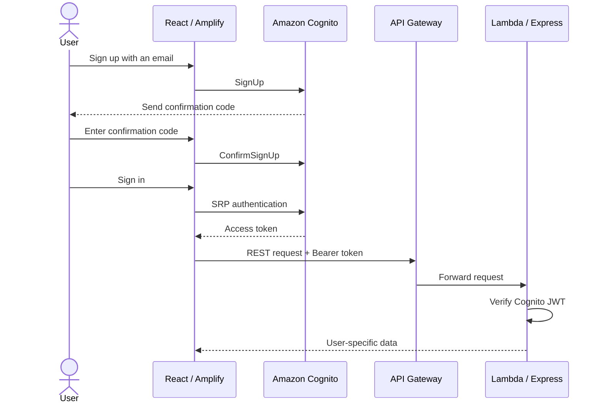

# Connect the Frontend to Amazon Cognito

In this section, an Amazon Cognito User Pool is configured to manage Polly Voice
accounts. The React frontend uses Cognito to sign users up, send email
confirmation codes, sign users in, obtain access tokens, and send those tokens
to the backend.

Authentication flow:



{}
The frontend is a Single-page Application running in a browser, so its App
Client must not use a client secret. A secret embedded in browser JavaScript
cannot be protected from the user.
{}

## Create a Cognito User Pool

1. Open the [Amazon Cognito Console](https://console.aws.amazon.com/cognito/).
Verify that the selected region is **Europe (Stockholm) – `eu-north-1`**, then
select **Create user pool** or **Set up resources for your application**.


2. Under **Define your application**, select:

```text
Application type: Single-page application (SPA)
Application name: polly-voice
```

The SPA type is appropriate for the React frontend and creates an App Client
without a client secret.


3. Under **Options for sign-in identifiers**, keep only **E-mail**:

```text
E-mail:       Selected
Phone number: Not selected
Username:     Not selected
```

Polly Voice uses an email address for both sign-up and sign-in. Excluding a
username and phone number prevents the interface from having to manage extra
identifiers or phone verification.


{}
Sign-in identifiers are important settings and cannot be changed freely after
the User Pool is created. Verify that only E-mail is selected.
{}

4. Under **Required attributes for sign-up**, select the `name` attribute if the
AWS Console allows additional attributes to be selected. Email is already used
as the sign-in identifier.

The frontend submits these attributes during sign-up:

```text
email
name
```

If the page requests a **Return URL**, enter the Amplify domain obtained in
section 5.4.1:

```text
https://<branch>.<app-id>.amplifyapp.com
```

The current code uses Cognito SRP directly instead of the Hosted UI, so the
Return URL is not part of the primary sign-in flow. Leave it empty when the
field is optional.


5. Review the settings and select **Create user pool** or
**Create user directory**.

Expected result:

- A Cognito User Pool is created in `eu-north-1`.
- The `polly-voice` App Client is created.
- The App Client has no client secret.
- Email is used as the sign-in identifier.


## Obtain the Cognito connection values

6. After creation succeeds, open:

```text
Amazon Cognito
→ User pools
→ The newly created User Pool
→ Overview
```

Locate and record the **User pool ID**. Its format is:

```text
eu-north-1_xxxxxxxxx
```

This value is used for:

```text
VITE_COGNITO_USER_POOL_ID
```


7. In the User Pool, open:

```text
Applications
→ App clients
→ polly-voice
```

Locate and record the **Client ID**. This value is used for:

```text
VITE_COGNITO_CLIENT_ID
```

Verify that **Client secret** displays `-`, `None`, or
**No client secret**.


{}
Do not confuse the User Pool ID, App Client ID, and User Pool ARN. The frontend
requires the User Pool ID and App Client ID, not the ARN.
{}

## Verify the App Client

8. In the `polly-voice` App Client, verify that the authentication flows include:

```text
Secure remote password (SRP)
Get user tokens from existing authenticated sessions
```

The React code uses `amazon-cognito-identity-js` and SRP authentication. A
machine-to-machine or client credentials flow is not required.


9. Open **Authentication** or **Sign-up** in the User Pool and verify:

- Self-service sign-up is enabled.
- Cognito sends confirmation codes by email.
- Email is used to verify the account.
- A user must confirm the code before signing in.
- The password policy matches the interface, for example at least 8 characters.


## Update the Amplify frontend

10. Open the `polly-voice` Amplify application and select:

```text
Hosting
→ Environment variables
```

Update or add:

| Variable | Value | Description |
|---|---|---|
| `VITE_AWS_ENABLED` | `true` | Enables Cognito authentication in the frontend. |
| `VITE_AWS_REGION` | `eu-north-1` | The region containing the Cognito User Pool. |
| `VITE_COGNITO_USER_POOL_ID` | `eu-north-1_xxxxxxxxx` | The ID of the newly created User Pool. |
| `VITE_COGNITO_CLIENT_ID` | `<APP_CLIENT_ID>` | The ID of the `polly-voice` SPA App Client. |

Keep the API Gateway URL configured in section 5.4.1:

```text
VITE_API_BASE_URL=https://<API_ID>.execute-api.eu-north-1.amazonaws.com/api/v1
```

Complete production configuration:

```text
VITE_API_BASE_URL=https://<API_ID>.execute-api.eu-north-1.amazonaws.com/api/v1
VITE_AWS_ENABLED=true
VITE_AWS_REGION=eu-north-1
VITE_COGNITO_USER_POOL_ID=eu-north-1_xxxxxxxxx
VITE_COGNITO_CLIENT_ID=xxxxxxxxxxxxxxxxxxxxxxxxxx
```


{}
The User Pool ID and App Client ID are not secrets. However, do not store a
password, access token, ID token, refresh token, or AWS credentials in these
variables.
{}

11. After saving the environment variables, select **Redeploy this version** or
start a new deployment for the production branch.

Redeployment is required because Vite embeds `VITE_*` variables in the
JavaScript bundle during the build. Saving a variable without rebuilding leaves
the website on the previous configuration.


## Synchronize the backend configuration

12. The backend must verify JWTs from the same User Pool and App Client used by
the frontend. Verify the Lambda environment variables:

```text
AWS_COGNITO_USER_POOL_ID
AWS_COGNITO_CLIENT_ID
AWS_COGNITO_ISSUER_URI
```

The issuer URI has this format:

```text
https://cognito-idp.eu-north-1.amazonaws.com/<USER_POOL_ID>
```

If the newly created User Pool or App Client differs from the backend
configuration, update the SAM parameters and redeploy the backend. A frontend
and backend using different User Pools will cause JWT validation to fail.


{}
Do not edit Lambda environment variables manually when the function is managed
by CloudFormation. Update the SAM/CloudFormation parameters to avoid
configuration drift.
{}

## Test sign-up and sign-in

13. Open the Amplify production website and select **Sign up**. Enter:

- Display name.
- Email address.
- A password that satisfies the password policy.

After sign-up, the interface changes to a confirmation code form. Cognito sends
the code to the registered email address.


14. Enter the confirmation code and confirm the account. If the code expires or
the email is not received, use **Resend confirmation code**.

The code form is displayed inside the application and does not depend on a
browser popup.


15. After confirmation, sign in with the email address and password. Sign-in is
successful when:

- The header displays the user name.
- The Sign in button changes to Sign out.
- Profile displays the Cognito Subject ID.
- TTS enables the authenticated-user limit.
- History can be accessed.


16. In the Cognito Console, open:

```text
User management
→ Users
```

Verify that the new user has this status:

```text
CONFIRMED
```


17. Open Developer Tools → **Network**, call a protected endpoint such as
History, and verify that the request contains:

```http
Authorization: Bearer <access-token>
```

Do not include the complete token in a report screenshot. Keep only the header
name visible or mask most of the token value.


## Common issues

| Error | Cause | Resolution |
|---|---|---|
| `User is not confirmed` | The user has not entered the confirmation code | Open the Confirm form or resend the code |
| `User does not exist` | The email belongs to a different User Pool | Verify `VITE_COGNITO_USER_POOL_ID` |
| `Incorrect username or password` | Incorrect credentials or a changed password | Verify the credentials or reset the password |
| `Invalid client` | Incorrect App Client ID or an App Client with a secret | Use the SPA App Client without a secret |
| API returns HTTP 401 | Frontend and backend use different User Pools or Client IDs | Synchronize Amplify variables and SAM parameters |
| Website still uses old settings | Variables were saved without rebuilding | Redeploy the Amplify branch |
| Confirmation email is missing | Incorrect email, spam filtering, or code not resent | Verify the address and use Resend code |

## Result

Amazon Cognito is now connected to the Polly Voice frontend. Users can sign up,
confirm their email addresses, sign in, and sign out on the Amplify website. The
frontend obtains an access token from Cognito and sends it to API Gateway; the
backend validates the token and separates TTS/STT history by Cognito Subject ID.
